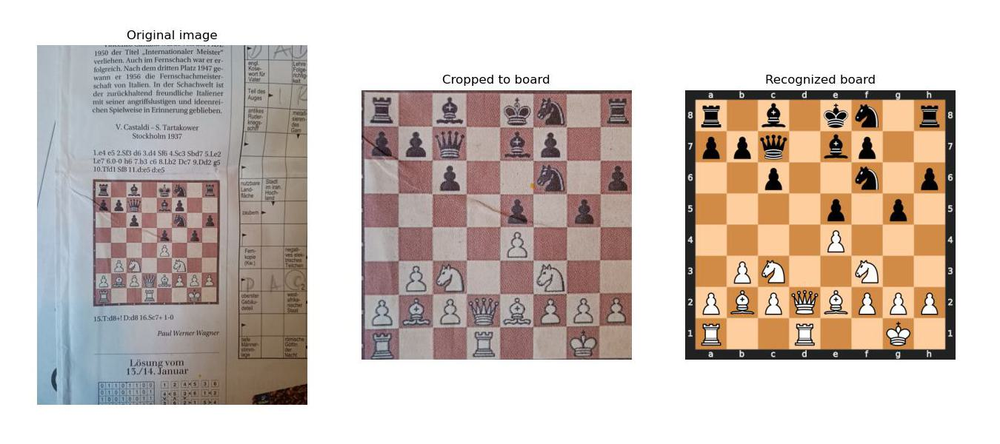
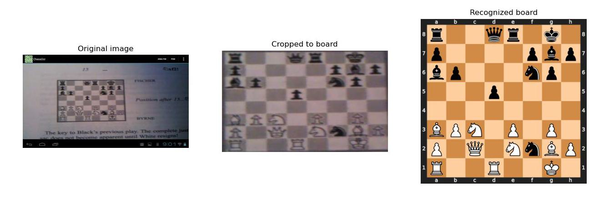
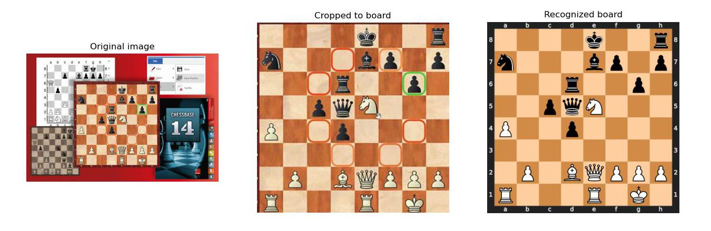
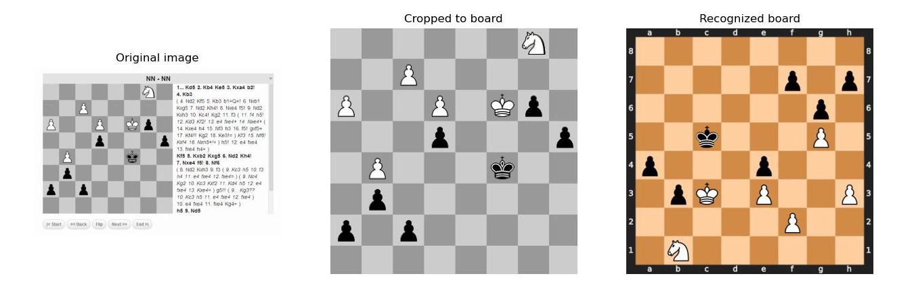
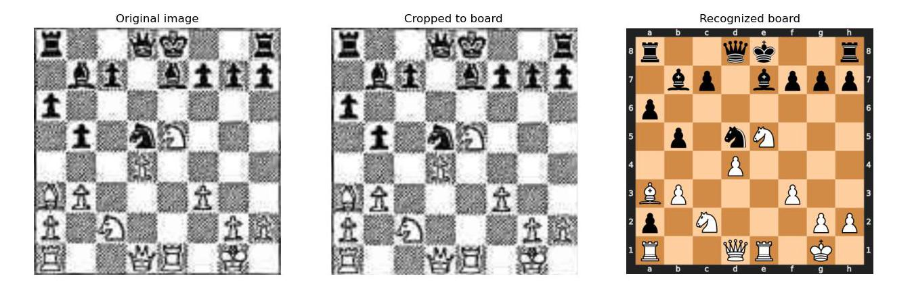
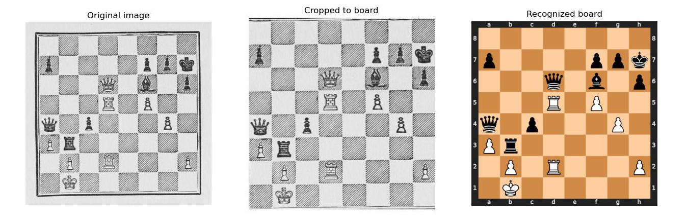
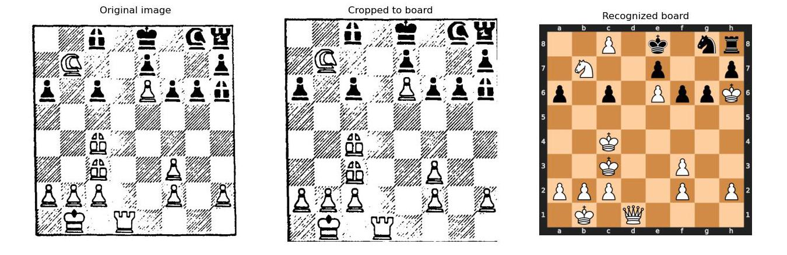
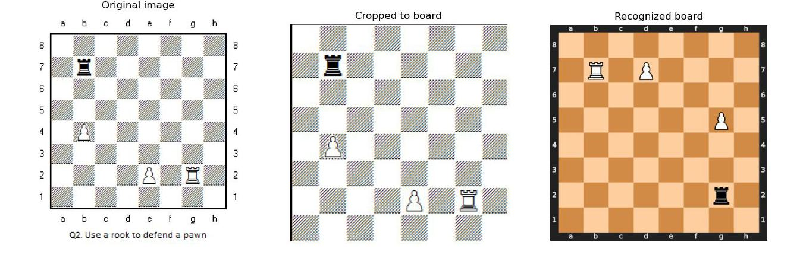
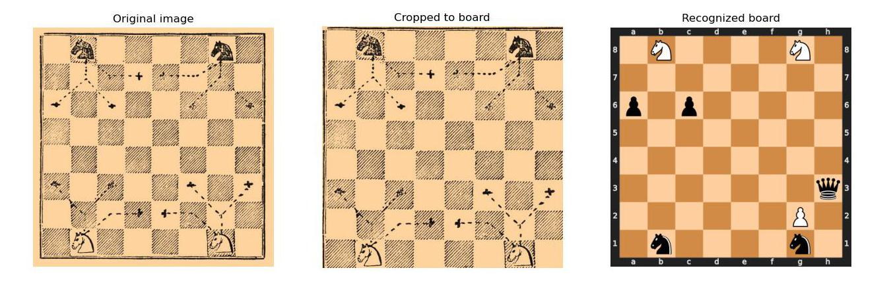

# Chess diagram to FEN

Extract the FEN out of images of chess diagrams.

## Install

0. (Optional) It is suggested to use a conda environment.
1. Install [PyTorch](https://pytorch.org/get-started/locally/) (e.g. `pip install torch torchvision --index-url https://download.pytorch.org/whl/cpu`, but CUDA and ROCm should also both work fine).
2. Download and install `Chess_diagram_to_FEN` package:
```shell
git clone "https://github.com/tsoj/Chess_diagram_to_FEN.git"
# Or use as git submodule
# git submodule add "https://github.com/tsoj/Chess_diagram_to_FEN"

pip install ./Chess_diagram_to_FEN
```

## Usage

```python
from PIL import Image
from chess_diagram_to_fen import get_fen

img = Image.open("your_image.jpg")
fen = get_fen(img=img, num_tries=10, return_cropped_img=False, auto_rotate=True)

print(fen)
```

Or use the demo program:
```shell
python chess_diagram_to_fen.py --shuffle_files --dir resources/test_images
```


## Train models yourself

#### Generate training data
Needs about **40 GB** disk space.
```shell
python main.py generate fen

# It is important to generate the fen data before
# the bbox data, since the bbox data generation
# relies on the fen training data

pip install gdown
./download_website_screenshots.sh
python main.py generate bbox

./download_lichess_games.sh
```

#### Review datasets (optional)

```shell
python main.py dataset bbox
python main.py dataset fen
python main.py dataset orientation
```

#### Train

```shell
python main.py train bbox
python main.py train fen
python main.py train orientation
```

#### Evaluate (optional)

```shell
python main.py eval fen
python main.py eval orientation
```

## Examples

### Successes










### Failures












